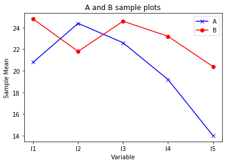

```python
import numpy as np
import pandas as pd
import pylab as plt
```


```python
#写入甲的数据

jia = np.array([[11,18,15,18,15],[33,27,31,21,17],
                [20,28,27,23,19],[18,26,18,18,9],
                [22,23,22,16,10],[20.8,24.4,22.6,19.2,14.0]])
jia_data = pd.DataFrame(jia,columns=['I1','I2','I3','I4','I5'],
                        index=['1','2','3','4','5','Mean'])
jia_data
```


<div>
<style>
    .dataframe thead tr:only-child th {
        text-align: right;
    }

    .dataframe thead th {
        text-align: left;
    }

    .dataframe tbody tr th {
        vertical-align: top;
    }
</style>
<table border="1" class="dataframe">
  <thead>
    <tr style="text-align: right;">
      <th></th>
      <th>I1</th>
      <th>I2</th>
      <th>I3</th>
      <th>I4</th>
      <th>I5</th>
    </tr>
  </thead>
  <tbody>
    <tr>
      <th>1</th>
      <td>11.0</td>
      <td>18.0</td>
      <td>15.0</td>
      <td>18.0</td>
      <td>15.0</td>
    </tr>
    <tr>
      <th>2</th>
      <td>33.0</td>
      <td>27.0</td>
      <td>31.0</td>
      <td>21.0</td>
      <td>17.0</td>
    </tr>
    <tr>
      <th>3</th>
      <td>20.0</td>
      <td>28.0</td>
      <td>27.0</td>
      <td>23.0</td>
      <td>19.0</td>
    </tr>
    <tr>
      <th>4</th>
      <td>18.0</td>
      <td>26.0</td>
      <td>18.0</td>
      <td>18.0</td>
      <td>9.0</td>
    </tr>
    <tr>
      <th>5</th>
      <td>22.0</td>
      <td>23.0</td>
      <td>22.0</td>
      <td>16.0</td>
      <td>10.0</td>
    </tr>
    <tr>
      <th>Mean</th>
      <td>20.8</td>
      <td>24.4</td>
      <td>22.6</td>
      <td>19.2</td>
      <td>14.0</td>
    </tr>
  </tbody>
</table>
</div>


```python
#写入乙的数据

yi = np.array([[18,17,20,18,18],[31,24,31,26,20],
              [14,16,17,20,17],[25,24,31,26,28],
              [36,28,24,26,29],[24.8,21.8,24.6,23.2,20.4]])
yi_data = pd.DataFrame(yi,columns=['I1','I2','I3','I4','I5'],
                        index=['1','2','3','4','5','Mean'])
yi_data
```


<div>
<style>
    .dataframe thead tr:only-child th {
        text-align: right;
    }

    .dataframe thead th {
        text-align: left;
    }

    .dataframe tbody tr th {
        vertical-align: top;
    }
</style>
<table border="1" class="dataframe">
  <thead>
    <tr style="text-align: right;">
      <th></th>
      <th>I1</th>
      <th>I2</th>
      <th>I3</th>
      <th>I4</th>
      <th>I5</th>
    </tr>
  </thead>
  <tbody>
    <tr>
      <th>1</th>
      <td>18.0</td>
      <td>17.0</td>
      <td>20.0</td>
      <td>18.0</td>
      <td>18.0</td>
    </tr>
    <tr>
      <th>2</th>
      <td>31.0</td>
      <td>24.0</td>
      <td>31.0</td>
      <td>26.0</td>
      <td>20.0</td>
    </tr>
    <tr>
      <th>3</th>
      <td>14.0</td>
      <td>16.0</td>
      <td>17.0</td>
      <td>20.0</td>
      <td>17.0</td>
    </tr>
    <tr>
      <th>4</th>
      <td>25.0</td>
      <td>24.0</td>
      <td>31.0</td>
      <td>26.0</td>
      <td>28.0</td>
    </tr>
    <tr>
      <th>5</th>
      <td>36.0</td>
      <td>28.0</td>
      <td>24.0</td>
      <td>26.0</td>
      <td>29.0</td>
    </tr>
    <tr>
      <th>Mean</th>
      <td>24.8</td>
      <td>21.8</td>
      <td>24.6</td>
      <td>23.2</td>
      <td>20.4</td>
    </tr>
  </tbody>
</table>
</div>


```python
# 画出轮廓分析图

plt.figure()
plt.plot(jia_data.ix['Mean'],marker='x',color='b',label='A')
plt.plot(yi_data.ix['Mean'],marker='o',color='r',label='B')
plt.ylabel('Sample Mean')
plt.xlabel('Variable')
plt.title('A and B sample plots')
plt.legend(loc='best')
plt.show()
```

    C:\Anaconda3\lib\site-packages\ipykernel_launcher.py:4: DeprecationWarning: 
    .ix is deprecated. Please use
    .loc for label based indexing or
    .iloc for positional indexing
    
    See the documentation here:
    http://pandas.pydata.org/pandas-docs/stable/indexing.html#ix-indexer-is-deprecated
      after removing the cwd from sys.path.
    C:\Anaconda3\lib\site-packages\ipykernel_launcher.py:5: DeprecationWarning: 
    .ix is deprecated. Please use
    .loc for label based indexing or
    .iloc for positional indexing
    
    See the documentation here:
    http://pandas.pydata.org/pandas-docs/stable/indexing.html#ix-indexer-is-deprecated
      """
    





```python
# 设置相应参数
n1 = 5
n2 = 5
k = 4

C = np.array([[1,-1,0,0,0],[0,1,-1,0,0],
              [0,0,1,-1,0],[0,0,0,1,-1]])
C = pd.DataFrame(C)
```


```python
#计算样本均值之差

M = jia_data.ix['Mean'] - yi_data.ix['Mean']
M
```


    I1   -4.0
    I2    2.6
    I3   -2.0
    I4   -4.0
    I5   -6.4
    Name: Mean, dtype: float64


```python
# 计算联合协方差

S1 = jia_data.iloc[0:5,:].cov()
S2 = yi_data.iloc[0:5,:].cov()
Sp = ((n1-1)*S1+(n2-1)*S2) / (n1+n2-2)
Sp
```


<div>
<style>
    .dataframe thead tr:only-child th {
        text-align: right;
    }

    .dataframe thead th {
        text-align: left;
    }

    .dataframe tbody tr th {
        vertical-align: top;
    }
</style>
<table border="1" class="dataframe">
  <thead>
    <tr style="text-align: right;">
      <th></th>
      <th>I1</th>
      <th>I2</th>
      <th>I3</th>
      <th>I4</th>
      <th>I5</th>
    </tr>
  </thead>
  <tbody>
    <tr>
      <th>I1</th>
      <td>72.700</td>
      <td>33.025</td>
      <td>41.65</td>
      <td>18.675</td>
      <td>22.550</td>
    </tr>
    <tr>
      <th>I2</th>
      <td>33.025</td>
      <td>21.250</td>
      <td>21.30</td>
      <td>12.725</td>
      <td>14.675</td>
    </tr>
    <tr>
      <th>I3</th>
      <td>41.650</td>
      <td>21.300</td>
      <td>41.30</td>
      <td>16.350</td>
      <td>17.850</td>
    </tr>
    <tr>
      <th>I4</th>
      <td>18.675</td>
      <td>12.725</td>
      <td>16.35</td>
      <td>11.450</td>
      <td>13.700</td>
    </tr>
    <tr>
      <th>I5</th>
      <td>22.550</td>
      <td>14.675</td>
      <td>17.85</td>
      <td>13.700</td>
      <td>25.650</td>
    </tr>
  </tbody>
</table>
</div>


```python
# 计算C(X_ba_jia - X_ba_yi)

A = np.array(C) @ np.array(M)
A
```


    array([-6.6,  4.6,  2. ,  2.4])


```python
# 计算CSpC'

B = np.array(C) @ np.array(Sp) @ np.array(C).T 
B
```


    array([[ 27.9  ,  -8.575,  14.4  ,  -1.925],
           [ -8.575,  19.95 , -16.375,  -0.45 ],
           [ 14.4  , -16.375,  20.05 ,   0.75 ],
           [ -1.925,  -0.45 ,   0.75 ,   9.7  ]])


```python
# 对上一步求逆

D = np.linalg.inv(B)
D
```


    array([[ 0.06516278, -0.03198824, -0.07356626,  0.01713591],
           [-0.03198824,  0.16782494,  0.16044839, -0.01096829],
           [-0.07356626,  0.16044839,  0.23469693, -0.02530268],
           [ 0.01713591, -0.01096829, -0.02530268,  0.10794102]])


```python
#计算霍特林统计量

T2 = ((n1*n2)/(n1+n2)) * np.array(M).T @ np.array(C).T @ D @ A
T2
```


    34.397422096273075


```python
# 计算相应的F统计量

F = (n1+n2-k-1)/(k*(n1+n2-2)) * T2
F
```


    5.3745972025426685


```python
#计算相应的p值

from scipy.stats import f
p_value = f.sf(F,k,n1)
p_value
```


    0.046835093793707996


